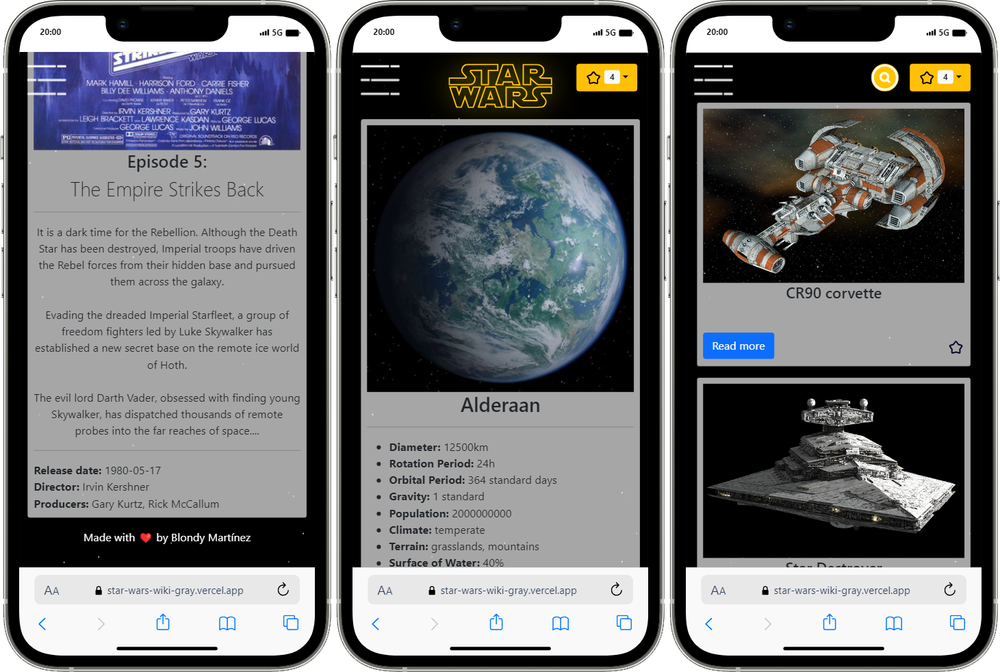

<h1>Star Wars Wiki</h1>
<h2>Overview</h2>
Star Wars Galaxy Explorer is a comprehensive web application built with React, offering a rich and immersive experience for fans of the iconic Star Wars franchise. Users can delve into the vast universe, exploring detailed information about characters, planets, starships, vehicles, species, and films.
<h4><a href="https://star-wars-wiki-gray.vercel.app/">Deployment</a></h4>
<h2>Features</h2>
<ul>
  <li><b>Extensive Data:</b> Explore detailed information about various aspects of the Star Wars universe, including characters, planets, starships, vehicles, species, and films.</li>
  <li><b>User-Friendly Interface:</b> Navigate seamlessly through the application with an intuitive and visually appealing user interface.</li>
  <li><b>Favorites:</b> Easily manage your favorite items and keep track of them using the favorites feature.</li>
  <li><b>Responsive Design:</b> Enjoy a consistent experience across devices with responsive design optimized for desktop and mobile.</li>
</ul>
<h2>Technologies Used</h2>
<p align="center">
  <a href="https://reactjs.org/">
    
  </a>
</p>
<h2>Getting Started</h2>
1. Clone the repository:

```bash
git clone git@github.com:BlondyMartinez/StarWars-Wiki.git
```
2. Install dependencies:

```bash
cd StarWars-Wiki
npm install
```
3. Start the development server:
```bash
npm run start
```

<h2>Preview</h2>


